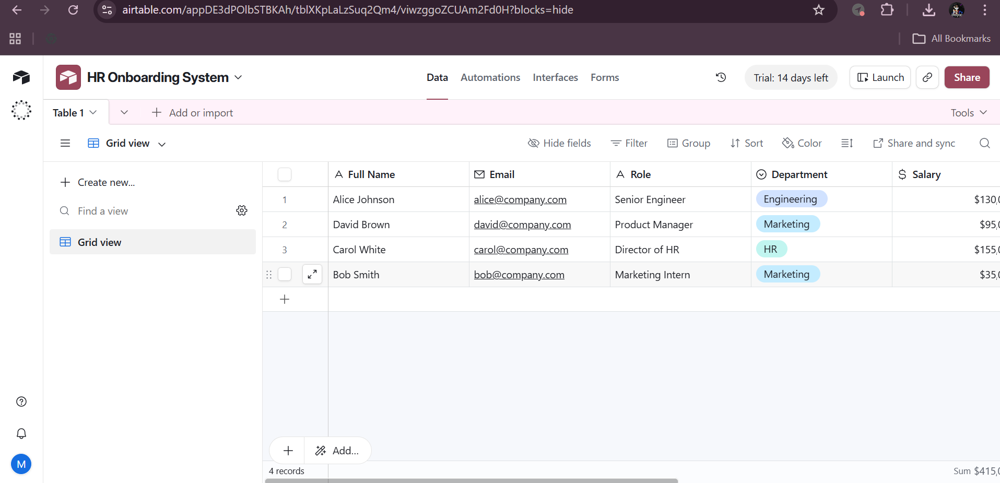
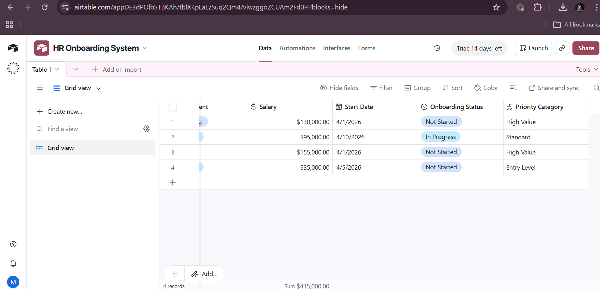
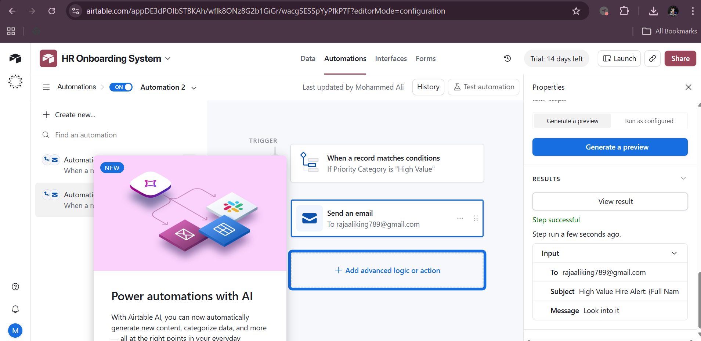
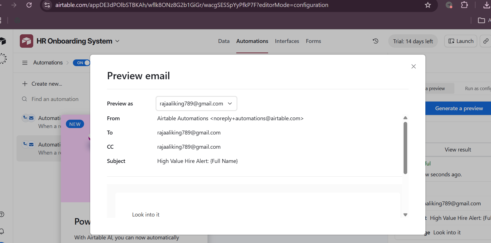

# Task 2 Solution — Automation and HR Dashboard

**Submitted by:** Mohammed Ali  
**Date:** March 2026

---

## Automation: High Value Hire Detection

### Automation Configuration

**Trigger:** When a record matches a condition  
**Condition:** `{Priority Category}` is `"High Value"`  
**Actions:**
1. Update record — set `{Onboarding Status}` to `"In Progress"`
2. Send email notification to HR team
3. Create a linked task in the Onboarding Tasks table

### Automation Setup Steps

1. Go to **Automations** tab in Airtable
2. Click **+ New Automation**
3. Set trigger: **"When a record matches conditions"**
4. Select table: **New Hires**
5. Set condition: `Priority Category` **is** `High Value`
6. Add Action 1: **"Update record"**
   - Set field `Onboarding Status` → `In Progress`
   - Set field `Assigned HR` → HR Manager name
7. Add Action 2: **"Send an email"**
   - To: `hr-team@company.com`
   - Subject: `🚨 High Value Hire Alert: {Full Name}`
   - Body (see template below)
8. Toggle automation to **ON**

### Email Template Used

```
Subject: 🚨 High Value Hire Alert: {Full Name}

Hi HR Team,

A new high-value hire has been added to the onboarding pipeline.

Employee Details:
- Name: {Full Name}
- Role: {Role}
- Department: {Department}
- Start Date: {Start Date}
- Salary: {Salary}
- Seniority: {Seniority Level}

Action Required:
Please prioritize this candidate's onboarding and ensure:
✅ IT equipment request submitted
✅ Benefits package confirmed
✅ Executive welcome scheduled
✅ Mentor assigned

View record: {Airtable Record URL}

HR Automation System
```

---

## HR Dashboard (Interface Designer)

### Interface Layout

The HR Dashboard was built using **Airtable Interface Designer** with the following components:

#### Page 1: Onboarding Overview

**Component 1 — Summary Metrics (Number blocks)**
- Total Active Hires: `COUNT({Full Name})`
- High Value Hires: `COUNTIF({Priority Category}, "High Value")`
- Starting This Week: count of records with Days Until Start 0–7
- Completed Onboarding: `COUNTIF({Onboarding Status}, "Completed")`

**Component 2 — Onboarding Pipeline (Kanban)**
- Grouped by: `Onboarding Status`
- Columns: Not Started → In Progress → Completed
- Cards show: Name, Role, Department, Start Date

**Component 3 — High Value Hires Table**
- Filtered view showing only Priority = "High Value"
- Columns: Name, Role, Department, Salary, Start Date, Assigned HR
- Sorted by: Start Date (ascending)

#### Page 2: Department Analytics

**Component 1 — Hires by Department (Bar Chart)**
- X-axis: Department
- Y-axis: Count of hires
- Color: by Priority Category

**Component 2 — Seniority Distribution (Pie Chart)**
- Segments: Senior / Mid Level / Entry Level
- Shows percentage breakdown

**Component 3 — Upcoming Starts Calendar**
- Calendar view by Start Date
- Color coded by Priority Category

#### Page 3: Individual Hire Records

**Component — Record Detail**
- Full employee profile
- Editable Onboarding Status
- Notes field for HR comments
- Timeline of onboarding steps

---

## Dashboard Features Demonstrated

| Feature | Implementation |
|---|---|
| Real-time metrics | Number summary blocks auto-update |
| Filtering by department | Dropdown filter on main table |
| High value identification | Color-coded Priority Category field |
| Pipeline tracking | Kanban grouped by Onboarding Status |
| Date-based urgency | Days Until Start formula + calendar |
| Department analytics | Bar chart grouped by department |

---

## Airtable Features Used

- **Formulas** — 6 formula fields for data processing and categorization
- **Automations** — Trigger on condition met → email + record update
- **Interface Designer** — 3-page HR dashboard with charts and kanban
- **Views** — 5 custom views (grid, filtered, grouped, calendar)
- **Single Select** — Consistent dropdown options for Status and Department
- **Linked Records** — Connected New Hires to Onboarding Tasks table

---

## Key Outcomes

The Airtable HR Onboarding Dashboard delivers:

1. **Automated priority detection** — High-value hires are flagged instantly without manual review
2. **HR team notifications** — Email alerts fired automatically when high-value hire added
3. **Visual pipeline** — Kanban view shows every hire's onboarding stage at a glance
4. **Executive visibility** — Dashboard metrics give leadership instant onboarding health snapshot
5. **Zero manual sorting** — Formulas categorize, clean, and prioritize all data automatically
---

## Screenshots

### Airtable Base — Table Structure with All Fields


### Formula Fields — Priority Category Working
Shows High Value (Alice, Carol), Standard (David), Entry Level (Bob) automatically calculated.


### Automation — Trigger and Email Action (ON)
Trigger: "When a record matches conditions — If Priority Category is High Value"
Action: Send an email notification to HR team


### Email Preview — High Value Hire Alert
Subject: "High Value Hire Alert: {Full Name}" — personalized per employee
